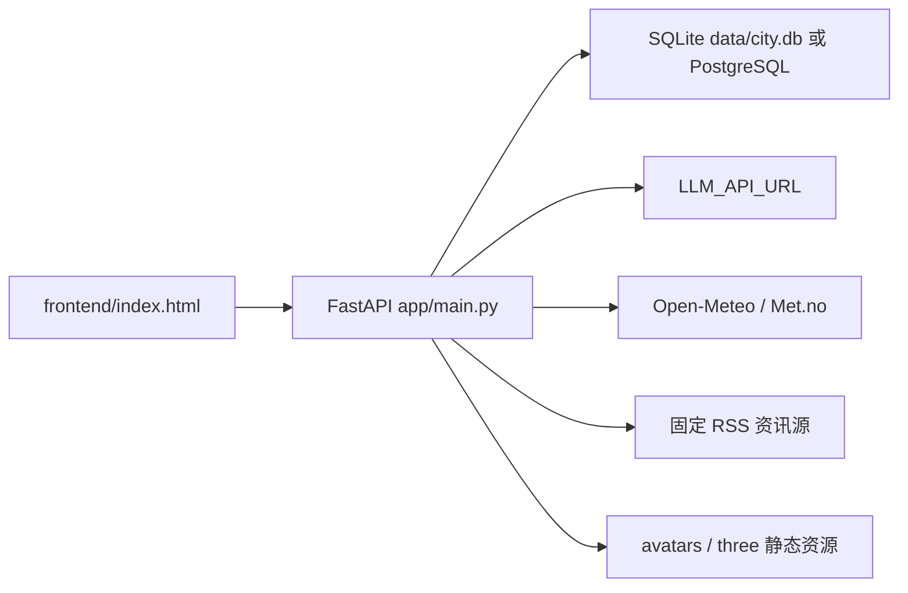
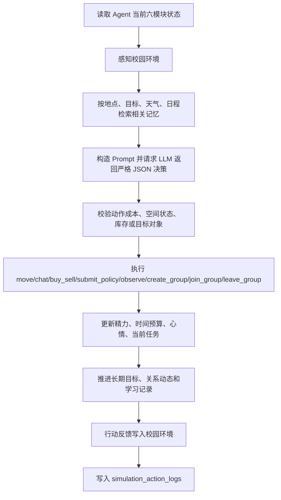

# 架构说明

## 系统定位

本项目是一个“校园封闭世界”多智能体沙盘。它不是聊天机器人外壳，而是一个可持续演化的小型世界模型：

1. 校园环境提供时间、天气、学期阶段、拥挤度、资源压力和活动事件。
2. Agent 拥有身份、目标、精力、时间预算、日程、关系、记忆和库存。
3. 每次模拟由后端驱动 Agent 感知、检索记忆、调用 LLM 决策、执行动作，并把结果写回环境与个人记忆。
4. 前端从 API 读取世界快照，展示地图、状态、日报和人物详情。

## 运行时组件

## 后端模块

`app/main.py` 是当前核心模块，包含：

- FastAPI 应用和路由定义。
- 校园环境派生逻辑，包括真实时间、真实天气和模拟天气。
- 空间系统，包括容量、开放时间、事件影响和可达性校验。
- Agent 六模块状态构造。
- 生命周期主流程：`perceive_environment()`、`decide_agent_action()`、`execute_decision()`、`apply_environment_feedback()`、`record_simulation_log()`。
- 社交、协作、长期目标、日报和外部资讯逻辑。

`app/db.py` 提供数据库连接：

- 未设置 `DATABASE_URL` 时使用 SQLite。
- 设置 `DATABASE_URL` 时使用 PostgreSQL。
- `PostgresConnection` 兼容项目里常见的 SQLite 风格 SQL，如 `?` 参数、`INSERT OR IGNORE`、`INSERT OR REPLACE INTO simulation_state`、`PRAGMA table_info(...)`。

`app/models.py` 保存基础表结构。`app/schema.py` 保存校园新版扩展表结构与默认环境。

`tools/city_tools.py` 是历史命名遗留，但仍是基础行动工具层，提供移动、聊天、交易、库存、事件、记忆和关系更新。

`services/llm_service.py` 负责调用外部 LLM。当前请求体使用 Google Gemini `generateContent` 风格，header 为 `x-goog-api-key`。

## Agent 生命周期

单个 Agent 的完整流程由 `run_lifecycle_step()` 执行：

如果 LLM 调用或 JSON 解析失败，决策会 fallback 到 `observe`。如果动作执行失败，系统会记录失败结果和成本，不会替 Agent 重新选择另一种行为。

## Agent 六模块

`get_agent_module_state()` 会将一个 Agent 汇总为六个模块：

- `Physical`：位置、身份、精力、时间预算、校园币、情绪、库存。
- `Mental`：长期目标、性格、当前任务。
- `Social`：关系对象、关系分数和说明。
- `Memory`：最近记忆、重要性、类型、标签和来源。
- `Schedule`：日程列表、当前接近日程、是否到点、建议地点。
- `Perception`：最近一次感知或外部资讯片段。

这个结构既服务前端人物详情，也服务 LLM 决策 prompt。

## 校园环境模型

校园环境保存在 `campus_state`。核心字段包括：

- 时间天气：`weather`、`temperature`、`rainfall`、`weekday`、`time_slot`、`semester_stage`、`real_date`、`real_time`。
- 学业压力：`exam_pressure`、`assignment_pressure`、`study_atmosphere`。
- 活动与人流：`activity_heat`、`event_name`、`event_intensity`、各空间 crowd 字段。
- 基础设施：`traffic_status`、`network_status`、`safety_level`、`resource_pressure`。
- 商业与氛围：`consumption_index`、`campus_mood`。

环境可以手动设置，也可以由真实时间、真实天气、模拟日推进和 Agent 行动共同改变。

## 空间模型

`campus_spaces` 定义七个固定空间：

- 宿舍区
- 教学楼
- 图书馆
- 食堂
- 操场
- 商业街
- 校务处

`get_space_snapshot()` 会结合空间容量、开放时间、当前小时、环境拥挤度、实际 Agent 数量和活跃事件，计算 `effective_status`、`available_slots`、`crowd_percent` 等运行状态。

## 数据演进策略

项目采用“启动/使用时补表补列”的轻量迁移方式：

- `ensure_campus_state_table()`
- `ensure_space_system()`
- `ensure_agent_profile_table()`
- `ensure_social_system_tables()`
- `ensure_external_information_system()`
- `ensure_memory_columns()`

这些函数会创建表，并对缺失列执行 `ALTER TABLE`。目前没有 Alembic 这类正式 migration 系统。

## 前端结构

`frontend/index.html` 是单文件应用，后端通过 `FileResponse` 返回页面，并挂载：

- `/avatars` -> `frontend/assets/avatars`
- `/three` -> `frontend/vendor/three`

前端主要请求：

- `/api/state`
- `/api/newspaper/agent-posts`
- `/api/external-information`
- `/api/agents/{id}/modules`
- `/api/agents/{id}/social-graph`
- `/api/agents/{id}/timeline`
- `/api/agents/{id}/simulation-logs`

## 历史命名说明

项目早期似乎从“虚拟城市/成都”示例演进而来，因此还存在：

- `city_events`
- `city_tools.py`
- `data/city.db`
- `scripts/init_db.py`

当前产品语义已经转为校园沙盘。维护时优先参考 `scripts/init_campus.py`、`app/schema.py` 和 `app/main.py` 中的校园系统。
