# 模拟一天流程

本文档描述前端点击“模拟一天”后，后端 `POST /api/simulate/ai-day` 的实际执行流程。它只覆盖“一天推进”这条主链路，不等同于整个项目架构；初始化、手动环境同步、外部资讯主动同步、Agent 详情页、关系网络和日报读取等流程见其他文档。

## 总览

“模拟一天”会把当前校园世界推进到下一天，并让数据库中的全部 Agent 依次完成一次自主行动。流程不是完整原子事务：`current_day` 更新后会立即提交，如果后续环境更新、Agent 行动或日报生成失败，日期不会自动回退。

高层步骤：

1. 前端调用 `POST /api/simulate/ai-day`。
2. 后端读取 `simulation_state.current_day`，加 1 后立即提交。
3. 生成当天校园环境，并尝试同步真实天气和真实时间。
4. 恢复全部 Agent 精力，重置每日时间预算。
5. 外部资讯沿关系网络传播。
6. 查询 `residents` 表中的全部 Agent，按 `id` 顺序逐个执行感知、决策、行动、反馈和日志写入。
7. 推进群体目标。
8. 为全部 Agent 生成第一人称日记。
9. 从当天行动中随机抽取最多 4 个生成第三人称校园新闻。
10. 写入当天自动模拟完成事件并返回结果。
11. 前端重新加载世界状态、日报和外部资讯。

## Mermaid 流程图

```mermaid
flowchart TD
    A["前端点击：模拟一天"] --> B["POST /api/simulate/ai-day"]
    B --> C["读取 simulation_state.current_day"]
    C --> D["current_day + 1"]
    D --> E["写回 current_day 并立即 commit"]

    E --> F["auto_update_environment(new_day)"]
    F --> F1["生成模拟天气、学期阶段、人流、压力等"]
    F1 --> F2["尝试同步真实天气"]
    F2 --> F3["根据真实时间修正校园状态"]
    F3 --> F4["写入 campus_state"]
    F4 --> F5["可能生成 campus_events"]

    F5 --> G["recover_agents_for_new_day"]
    G --> G1["全部 Agent 恢复部分精力"]
    G1 --> G2["重置 time_budget = 100"]

    G2 --> H["spread_external_information"]
    H --> H1["外部资讯沿关系网络传播"]
    H1 --> H2["写入 agent_information / memories"]

    H2 --> I["查询 residents 表中的全部 Agent"]
    I --> J["按 id 顺序遍历 Agent"]

    J --> K["perceive_environment"]
    K --> K1["读取校园环境、空间状态、个人状态"]
    K1 --> K2["写入感知记忆 memories"]

    K2 --> L["decide_agent_action"]
    L --> L1["读取六模块、相关记忆、其他 Agent、小组与环境"]
    L1 --> L2["构造 Prompt 调用 LLM"]
    L2 --> L3{"LLM / JSON 是否成功"}
    L3 -->|否| L4["降级生成 observe 决策"]
    L3 -->|是| L5["解析 JSON 决策"]
    L4 --> M
    L5 --> M["execute_decision"]

    M --> M1{"行动是否成功"}
    M1 -->|成功| N["执行原始行动"]
    M1 -->|动作失败| O["记录失败结果，保留 Agent 原选择"]
    N --> N1["更新位置、交易、政策、小组或关系"]
    O --> O1["写入失败事件与记忆"]

    N1 --> P["更新 Agent 状态"]
    O1 --> P
    P --> P1["扣 energy / time_budget"]
    P1 --> P2["更新 mood / current_task / perception"]
    P2 --> P3["推进 long_term_goals"]
    P3 --> P4["写入 agent_learning / memories / city_events"]

    P4 --> Q["apply_environment_feedback"]
    Q --> Q1["行动反馈到 campus_state"]

    Q1 --> R["record_simulation_log"]
    R --> R1["写入 simulation_action_logs"]

    R1 --> S{"Agent 管线是否发生外层异常"}
    S -->|是| T["rollback 后记录 fallback observe"]
    T --> T1["加入 fallback_agents"]
    S -->|否| U{"还有下一个 Agent?"}
    T1 --> U

    U -->|是| J
    U -->|否| V["advance_group_goals"]
    V --> V1["推进 group_goals"]
    V1 --> V2["降低旧 relationship_dynamics.tension"]

    V2 --> W["write_agent_daily_diaries"]
    W --> W1["遍历全部 residents"]
    W1 --> W2["调用 LLM 写第一人称日记"]
    W2 --> W3["写入 memories source=diary"]

    W3 --> X["publish_agent_news"]
    X --> X1["从当天 actions 随机抽取最多 4 个"]
    X1 --> X2["调用 LLM 写第三人称校园快讯"]
    X2 --> X3["写入 agent_news_posts"]

    X3 --> Y["写入 daily_reflect 事件"]
    Y --> Z["返回 simulate_ai_day 响应"]

    Z --> AA["前端 load()"]
    AA --> AB["GET /api/state"]
    AA --> AC["GET /api/newspaper/agent-posts"]
    AA --> AD["GET /api/external-information"]
    AB --> AE["刷新地图、Agent 列表、环境、日报"]
    AC --> AE
    AD --> AE
```



## Agent 遍历范围

后端不会硬编码 20 个 Agent，而是查询当前数据库中的全部居民：

```sql
SELECT id FROM residents ORDER BY id
```

因此如果未来种子数据或管理接口增加/删除 Agent，“模拟一天”会自动以 `residents` 表为准。

## 异常与降级

流程中有几层降级：

- LLM 调用失败或 JSON 解析失败：`decide_agent_action()` 会生成一个 `observe` 决策，原因中记录失败信息。
- 单个行动执行失败：`execute_decision()` 会回滚失败事务，写入失败事件和记忆，更新失败成本，并保留 Agent 原始选择，不强行替换成成功行动。
- 单个 Agent 外层管线异常：`simulate_ai_day()` 会回滚事务，尝试记录一次 fallback observe，加入 `fallback_agents`，然后继续处理下一个 Agent。
- 群体目标、日记或新闻生成失败：分别捕获异常并回滚对应阶段，避免整个接口直接中断。

## 写入的主要表

| 阶段 | 主要表 |
| --- | --- |
| 日期推进 | `simulation_state` |
| 校园环境 | `campus_state`, `campus_events`, `city_events` |
| 外部资讯传播 | `agent_information`, `memories` |
| Agent 感知和行动 | `residents`, `agent_profiles`, `memories`, `city_events` |
| 交易 | `inventory`, `transactions`, `residents` |
| 政策 | `policies`, `city_events`, `memories` |
| 社交关系 | `relationships`, `relationship_dynamics` |
| 目标与学习 | `long_term_goals`, `group_goals`, `agent_learning` |
| 可解释日志 | `simulation_action_logs` |
| 日记 | `memories` |
| 校园新闻 | `agent_news_posts` |

## 返回字段

`/api/simulate/ai-day` 返回的关键字段：

```text
message
day
environment
external_information_spread
actions
group_goal_updates
daily_diaries
published_news
fallback_agents
```

其中：

- `actions` 是每个 Agent 的感知、决策、执行和环境反馈结果。
- `daily_diaries` 是本次成功生成日记的 Agent 数量。
- `published_news` 是本次写入 `agent_news_posts` 的新闻摘要，最多来自 4 个 Agent。
- `fallback_agents` 是当日执行管线发生外层异常并降级观察的 Agent id 列表。

## 前端刷新

后端返回后，前端会重新调用 `load()` 并并行读取：

- `/api/state`
- `/api/newspaper/agent-posts`
- `/api/external-information`

这些接口负责刷新校园地图、Agent 列表、环境面板、外部资讯和校园日报。

## 实时进度呈现

前端“模拟一天”按钮使用后台任务进度接口：

```text
POST /api/simulate/ai-day/progress
GET /api/simulate/ai-day/progress/{job_id}?after=<event_index>
```

`POST` 会立即创建一个内存中的模拟任务并返回 `job_id`。后端在后台线程中执行完整的 `run_simulate_ai_day()`，每到一个阶段就向任务事件列表追加一条进度事件。前端每秒查询一次 `GET` 接口，只拉取 `after` 之后的新事件并追加到模拟弹窗中，因此用户可以看到日期推进、环境生成、每个 Agent 的感知/决策/行动、日志写入、日记生成和新闻发布进度。

典型事件：

```json
{"event":"day_advance","message":"模拟日从第 14 天推进到第 15 天。","day":15}
{"event":"agent_deciding","message":"林小夏（大一学生）正在检索记忆并生成自主决策。","agent_index":1,"total_agents":20}
{"event":"agent_logged","message":"林小夏（大一学生） 的决策日志已写入。","action":"chat","success":true}
{"event":"complete","message":"校园一天模拟完成","day":15,"actions_count":20}
```

旧接口和流式接口仍保留：

```text
POST /api/simulate/ai-day
POST /api/simulate/ai-day/stream
```

`POST /api/simulate/ai-day` 一次性返回完整 JSON，适合脚本或 API 调用。`POST /api/simulate/ai-day/stream` 返回 NDJSON，适合支持响应流的客户端；前端默认使用轮询式进度接口，因为它不依赖浏览器、代理或部署平台是否缓冲流式响应。
