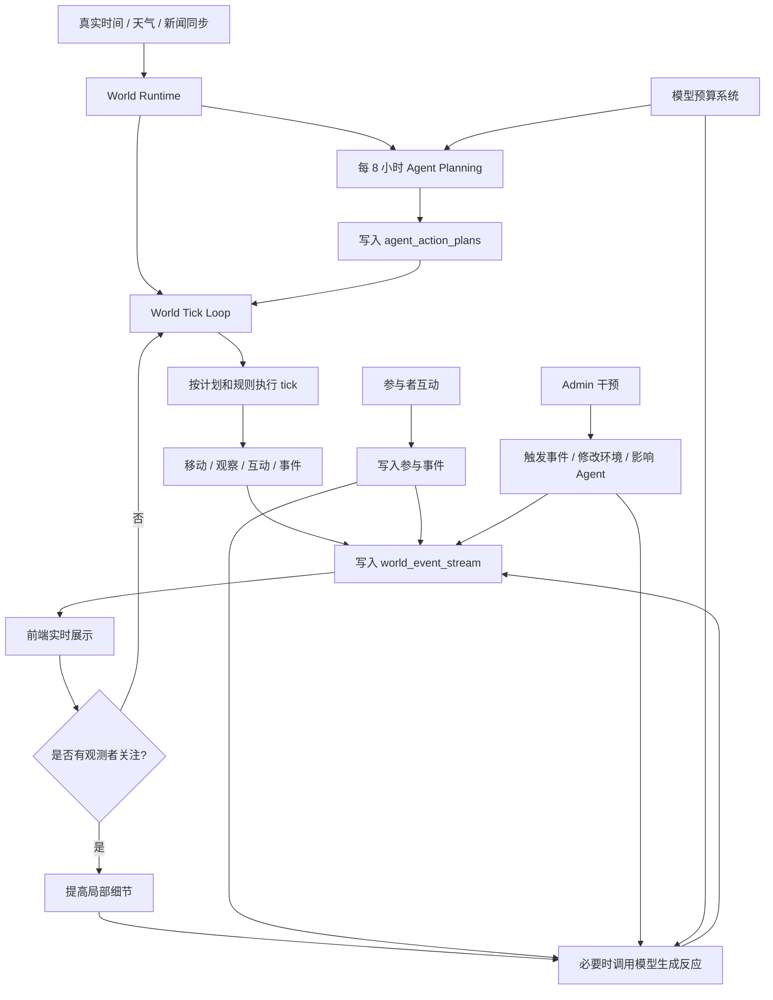

# 校园平行世界架构演进愿景

我很喜欢这个方向。你想要的其实不是“点一下模拟一天”，而是一个**持续运行的平行校园世界**：用户进入时，不是在操作一个工具，而是在观察一个已经自行运转的世界。

我会这样设计。

## 核心概念
把系统从“按钮触发模拟”升级成三层：

```text
世界时钟 World Clock
持续事件流 Event Stream
权限分层 Interaction Layer
```

进一步拆分为四类运行机制：

```text
8 小时计划 Planner
低成本 tick Runner
注意力触发 Attention Triggers
模型预算 Model Budget
```

普通用户默认是观察者，以观察为主；参与者可以和虚拟世界互动；admin 才能干预天气、事件、Agent、模拟速度、外部资讯、重置/回滚等。观测者打开页面、参与者互动、admin 干预都可以触发额外模型调用，但这些调用必须受每日预算和优先级控制。

## 8 小时行动计划

世界时间应和外部世界时间保持一致。每 8 小时为 Agent 制定下一段窗口的行动计划：

```text
00:00-08:00
08:00-16:00
16:00-24:00
```

如果世界设定为中国校园，推荐固定使用：

```text
world_timezone = Asia/Shanghai
```

每个计划窗口开始时，系统为 Agent 生成一个结构化计划。计划不是强制脚本，而是未来 8 小时的行动倾向。

示例：

```json
{
  "resident_id": 1,
  "window_start": "2026-07-26T08:00:00+08:00",
  "window_end": "2026-07-26T16:00:00+08:00",
  "intent": "适应校园生活并参加社团活动",
  "steps": [
    {
      "time": "08:30",
      "action": "move",
      "location": "食堂",
      "goal": "吃早餐并观察同学状态"
    },
    {
      "time": "10:00",
      "action": "observe",
      "location": "教学楼",
      "goal": "了解课堂氛围"
    },
    {
      "time": "14:30",
      "action": "chat",
      "target_hint": "新生或社团成员",
      "goal": "建立新关系"
    }
  ],
  "flexibility": 0.35
}
```

Agent 可以不按计划行动。偏离计划的原因包括：

- 天气变化。
- 空间拥挤或关闭。
- 突发校园事件。
- 社交邀请。
- 精力不足或心情变化。
- 重要记忆被触发。
- 观测者正在关注某个 Agent 或地点。
- 参与者与虚拟世界互动。
- admin 干预世界规则。

这种设计能让 Agent 有计划性，但不会变成死板脚本。

## 普通用户体验
用户一打开页面，就应该看到：

- 当前是第几天、第几个时段。
- 当前真实日期和世界时间。
- 校园里正在发生什么。
- 哪些 Agent 正在行动。
- 最新事件像 ticker 一样滚动。
- 地图上的 Agent 会移动或状态变化。
- 日报、日记、关系网络逐步更新。
- 用户不需要点“模拟一天”，世界本身就在走。

可以把主界面变成：

```text
顶部：世界时间 / 当前天气 / 运行状态
中间：校园地图 + Agent 动态位置
右侧：实时事件流
底部：今日摘要 / 热点新闻 / 关系变化
```

普通用户的操作只包括：

- 选择一个 Agent 观察。
- 查看某个地点。
- 查看时间线。
- 看日报。
- 暂停自己的视图滚动，不暂停世界。
- 搜索过去事件。

观测者打开页面本身也可以成为一种轻量触发器。例如：

- 进入页面：优先同步当前地图、事件流和正在行动的 Agent。
- 观察某个地点超过一段时间：提高该地点 tick 的细节。
- 打开某个 Agent 详情：必要时触发一次“被观察状态下的内心独白/反思/即时反应”模型调用。
- 长时间无人观看：世界继续运行，但降低细节和模型调用频率。

这可以称为 **attention-based simulation**：没人看时低成本演化，有人看时局部高保真。

## 参与者体验

参与者不是 admin，但可以通过有限动作影响虚拟世界。参与者行为也可以触发模型调用。

示例：

- 给某个 Agent 发一条消息。
- 在某个地点投放一条公告。
- 参与一次活动投票。
- 对某条校园新闻表达关注。
- 选择观察任务，让系统追踪某类事件。

参与者触发的模型调用应当局部化，只影响相关 Agent、地点或事件，不应每次都全局重算。建议把参与者影响写入事件流，再由相关 Agent 在下一个 tick 或下一次计划修订中吸收。

## Admin 体验
admin 多一个控制台：

- 开始/暂停世界运行。
- 设置模拟速度：实时 / 快速 / 每分钟推进一个时段 / 每小时推进一天。
- 手动触发校园事件。
- 修改天气、考试压力、人流、资源压力。
- 新增/编辑 Agent。
- 注入外部资讯。
- 重跑某一天或回滚。
- 查看失败任务和系统日志。
- 调整 LLM 模型、prompt 版本、随机种子。
- 导出研究数据。

也就是说，普通用户看“活的校园”，admin 管“世界规则”。

admin 干预属于高优先级触发器，允许消耗额外模型调用。例如：

- 手动触发突发事件后，让相关 Agent 生成即时反应。
- 修改考试压力后，让学生群体重规划学习行为。
- 注入外部资讯后，让高相关 Agent 解读并传播。
- 调整某个 Agent 目标后，触发局部 8 小时计划重算。

## 技术上怎么做
我建议不要让“模拟一天”继续承担所有事情，而是改成一个后台 world runner。

后端新增：

```text
world_runtime
world_ticks
world_event_stream
admin_actions
```

或者先简单一点：

```text
simulation_runtime
simulation_jobs
world_events
```

然后有一个后台循环：



注意我说的是 **tick**，不是“一天”。  
一天太粗了。更自然的是：

```text
tick = 一个小时间片
比如 5 分钟、15 分钟、一个时段
```

然后一天由多个 tick 组成：

```text
上午 -> 中午 -> 下午 -> 晚上 -> 深夜
```

这样用户进入页面时，总能看到世界正在发生过程，而不是等一个超长任务结束。

## 数据模型建议
可以新增这些表：

```text
world_runtime
- id
- status running/paused
- current_day
- current_slot
- speed
- updated_at

world_ticks
- id
- day
- slot
- tick_index
- started_at
- completed_at
- status

world_event_stream
- id
- tick_id
- day
- slot
- event_type
- resident_id
- location
- title
- content
- payload
- created_at

admin_actions
- id
- admin_id
- action_type
- payload
- created_at

agent_action_plans
- id
- resident_id
- window_start
- window_end
- plan_json
- model_name
- prompt_version
- status
- created_at

observer_sessions
- id
- user_id
- session_type observer/participant/admin
- focused_resident_id
- focused_location
- started_at
- last_seen_at

participant_actions
- id
- user_id
- action_type
- target_type
- target_id
- payload
- created_at

model_call_logs
- id
- trigger_type planner/observer/participant/admin/reflection/news
- resident_id
- related_event_id
- model_name
- prompt_version
- input_tokens
- output_tokens
- estimated_cost
- status
- created_at
```

前端只需要不断读：

```text
GET /api/world/runtime
GET /api/world/events?after_id=123
```

普通用户看到事件流。admin 才能：

```text
POST /api/admin/world/start
POST /api/admin/world/pause
POST /api/admin/world/speed
POST /api/admin/events/trigger
```

## 权限设计
先简单做：

```dotenv
ADMIN_TOKEN=xxx
```

admin 请求带：

```text
Authorization: Bearer xxx
```

后面再接登录系统。

普通用户：

- GET 状态
- GET 事件
- GET Agent
- GET 日报
- GET 地图
- 可创建 observer session。
- 可触发低成本观察型模型调用。

参与者：

- 拥有普通用户能力。
- 可发送有限互动。
- 可触发局部参与型模型调用。
- 不可直接修改世界规则。

Admin：

- POST/PUT/DELETE 控制世界
- 触发模拟
- 修改环境
- 管理 Agent
- 导出数据
- 管理模型预算和运行状态。

## 外部世界同步

外部信息应持续同步，但要和仿真世界语义分开：

```text
真实时间 real_time：外部世界当前时间
世界时间 world_time：平行校园采用的当前时间
真实观测时间 observed_at：天气、新闻等外部数据的来源时间
```

如果目标是“平行世界”，推荐 `world_time` 和外部真实时间保持一致。连续运行时不再用“点击一次模拟一天”的方式推进日期，而是由真实时间和 tick loop 自然推进。

同步频率建议：

| 内容 | 建议频率 | 用途 |
| --- | --- | --- |
| 时间/时段 | 每分钟或每 tick | 驱动课程、用餐、夜间等行为 |
| 天气 | 15-30 分钟 | 影响空间选择、人流、心情 |
| 新闻/RSS | 1-3 小时 | 进入外部资讯系统 |
| 8 小时计划 | 每 8 小时 | 控制 Agent 中期意图 |
| 日报/总结 | 每天 | 形成公共叙事和长期记忆 |

外部新闻不应让所有 Agent 同时知道。建议继续使用已有的 `external_information` / `agent_information` 思路：

```text
外部新闻 -> 少数相关 Agent 接收 -> 关系网络传播 -> 可能失真 -> 进入个人记忆
```

## 模型调用预算

模型调用需要显式预算。建议默认：

```text
daily_auto_model_budget = 100
```

自动调用预算建议：

| 用途 | 预算 |
| --- | --- |
| 8 小时计划 | 约 60 次/天，20 个 Agent × 3 个窗口 |
| 反思/日记/摘要 | 约 20 次/天，可批量或抽样 |
| 新闻/外部资讯解释 | 约 10 次/天 |
| 突发事件和局部重规划 | 约 10 次/天 |

额外模型调用触发源：

- 观测者打开页面或关注某个 Agent/地点。
- 参与者和虚拟世界互动。
- admin 主动干预世界。

这些额外调用可以接受，但要记录到 `model_call_logs`，并设置优先级：

```text
admin > participant > observer > automatic background
```

成本控制策略：

- 计划生成可以批量化，一次调用生成多个 Agent 的计划。
- tick 执行尽量用规则，不每步都调用模型。
- 无人观看时降低细节，只写关键事件。
- 有人观看时只提高被关注地点/Agent 的细节。
- 日记和新闻可以抽样或批量生成。
- 外部资讯只通知相关 Agent，不全员广播。
- 同一观察窗口内限制重复触发模型调用。

## 前端视觉方向
我会把现在的“管理面板”感降低，变成“观测台”：

- 校园地图是主角。
- 事件流像直播间/新闻线。
- Agent 卡片显示“正在做什么”，不是静态资料。
- 每个地点有活跃度。
- 时间缓慢推进，有昼夜和天气状态。
- Admin 控件隐藏在单独面板，不干扰普通观察体验。

## 分阶段实现
别一次重构完。建议四步：

1. **观察者/参与者/Admin 权限分层**
   隐藏普通用户的强操作按钮，只保留观察入口；参与者开放有限互动；admin 才显示“模拟一天/同步天气/触发事件/运行控制”。

2. **事件流**
   新增 `/api/world/events`，把 `city_events`、`simulation_action_logs`、`agent_news_posts` 整合成一个统一时间线。

3. **8 小时计划**
   新增 `agent_action_plans`，每 8 小时生成结构化计划，tick 期间按计划和规则执行。

4. **后台 tick**
   把“模拟一天”拆成“推进一个 tick”，每次只处理部分 Agent，前端可持续刷新。

5. **世界运行器**
   增加 start/pause/speed，由后台任务自动 tick，让世界持续运转。

6. **模型预算系统**
   记录所有自动、观测者、参与者、admin 触发的模型调用，按日统计费用和触发原因。

## 我的建议
先做第 1 和第 2 步：  
把产品感从“操作模拟器”改成“观察平行校园”，但不马上大改模拟核心。这样风险小，马上能看出方向对不对。

接着再拆 tick。  
这一步是架构升级，应该单独 PR、单独测试，别和 UI 混在一起。
